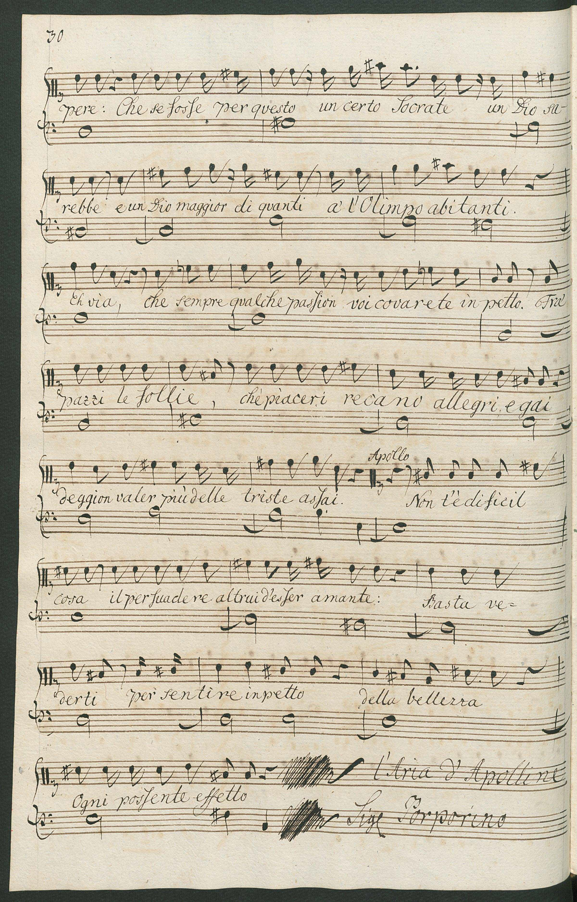
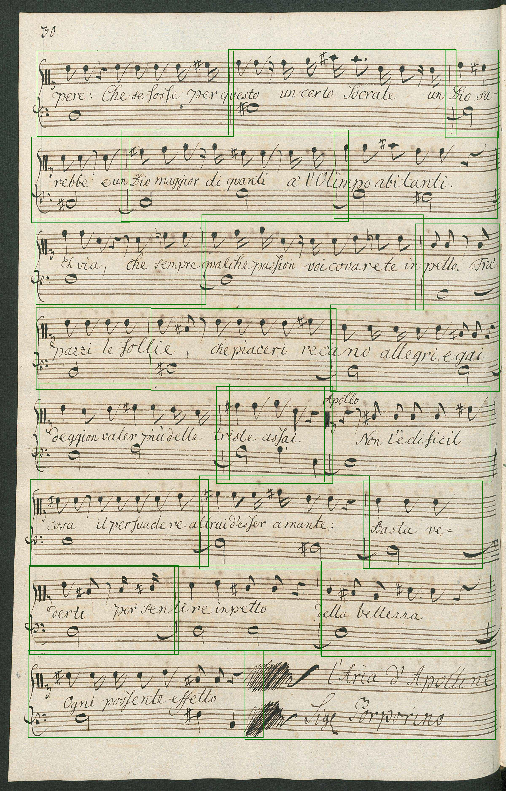

# Running this demo
Download the trained model from [Github](https://github.com/OMR-Research/MeasureDetector/releases/download/v1.0/2019-04-24_faster-rcnn_inception-resnet-v2.pb) and put it into this directory.

Then run `standalone_inference_over_image.py` from within this directory:

```bash
python standalone_inference_over_image.py --detection_inference_graph 2019-04-24_faster-rcnn_inception-resnet-v2.pb --input_image IMSLP454437-PMLP738602-Il_tempio_d_amore_Scene2-0002.jpg --output_image annotated_image.jpg --output_result output_detections.txt
```

## Input


## Output


In `output_detections.txt`
```csv
1334.776,285.438,1749.484,1316.372;system_measure
1723.900,286.765,2198.323,1309.903;system_measure
1860.291,1395.742,2197.614,2402.567;system_measure
1034.321,287.007,1355.492,1329.871;system_measure
805.227,285.142,1062.326,1342.350;system_measure
1563.501,2466.390,1920.072,3517.675;system_measure
1547.005,1389.880,1883.021,2408.892;system_measure
673.189,1398.620,1034.877,2408.196;system_measure
1009.829,1383.880,1300.315,2418.752;system_measure
993.728,2464.757,1197.796,3525.699;system_measure
307.479,2448.382,592.560,3538.360;system_measure
1895.303,2461.185,2191.740,3514.238;system_measure
537.721,283.032,833.709,1337.707;system_measure
1276.458,1376.009,1571.495,2408.346;system_measure
576.255,2471.385,775.806,3546.480;system_measure
305.754,274.793,564.641,1338.592;system_measure
76.871,1388.694,392.423,2415.331;system_measure
371.824,1407.226,698.391,2399.996;system_measure
1170.487,2461.377,1402.250,3521.331;system_measure
1380.603,2460.044,1588.939,3523.525;system_measure
749.596,2460.469,1009.443,3530.767;system_measure
77.719,263.964,325.477,1352.097;system_measure
81.447,2422.702,325.970,3543.818;system_measure
```