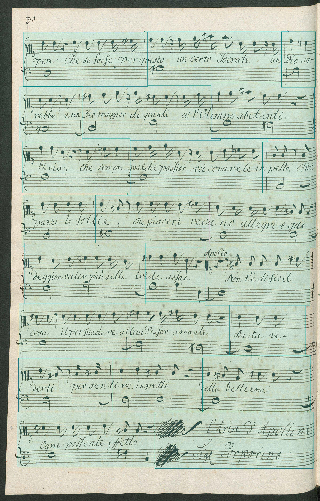
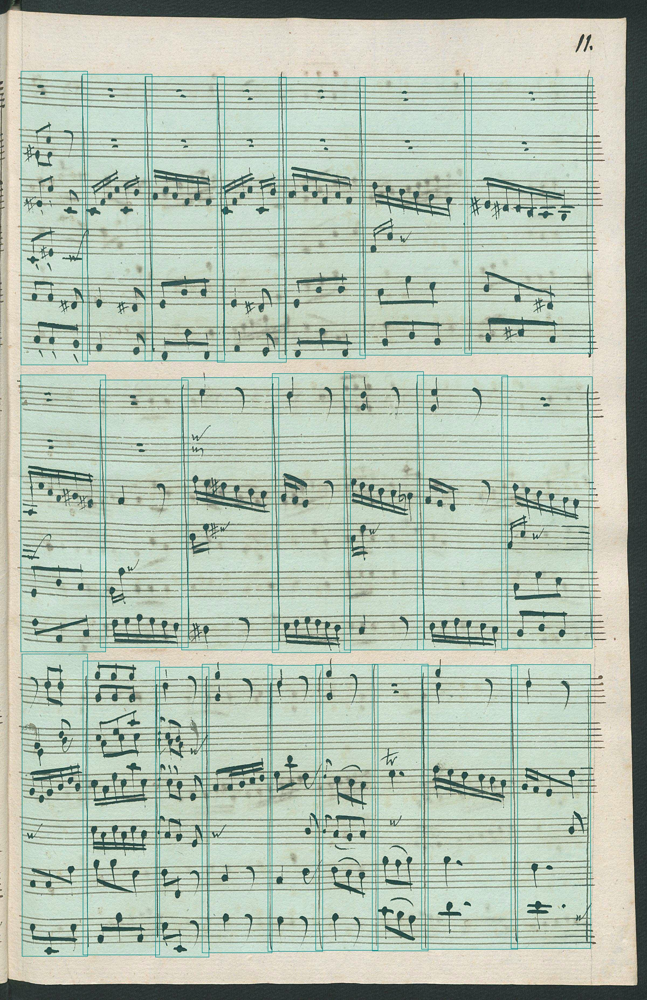

# Running the Standalone Demo
The easiest way to test this project is by running the standalone demo. 
Download the trained model from [Github](https://github.com/OMR-Research/MeasureDetector/releases/download/v1.0/2019-04-24_faster-rcnn_inception-resnet-v2.pb) and put it into this directory.

Then run [`standalone_inference_over_image.py`](standalone_inference_over_image.py) from within this directory:

```bash
python standalone_inference_over_image.py --detection_inference_graph 2019-04-24_faster-rcnn_inception-resnet-v2.pb --input_image IMSLP454437-PMLP738602-Il_tempio_d_amore_Scene2-0002.jpg --output_result output_detections.json
```

This will create an annotated image, as well as a json-file with the output detections.


## Input


## Output



# Running Inference as a Service
The second way to run inference for this project is by firing up an inference server that exposes a REST-API for easy consumption.

First, download the trained model from [Github](https://github.com/OMR-Research/MeasureDetector/releases/download/v1.0/2019-04-24_faster-rcnn_inception-resnet-v2.pb) and put it into this directory.

Then you can directly start the [server script](inference_server.py) with `hug -p=8080 -f=inference_server.py` (see [run_server.bat](run_server.bat)) or create and run a docker container with the following steps: 

```bash
# Build the image
$ docker build -t measure_detector .

# Run in container (change port to `XXXX:8080` if needed):
$ docker run -p 8080:8080 measure_detector
```

| ⚠️ WARNING: The server should only be used for testing, not deployment! |
| --- |

## Testing the REST-API

See [`test_rest_api.py`](test_rest_api.py) for an example how to query the REST-API using Python.

```bash
python test_rest_api.py --input_image IMSLP454435-PMLP738602-Il_tempio_d_amore_Sinfonia-0011.jpg
```

### Input


### Output
