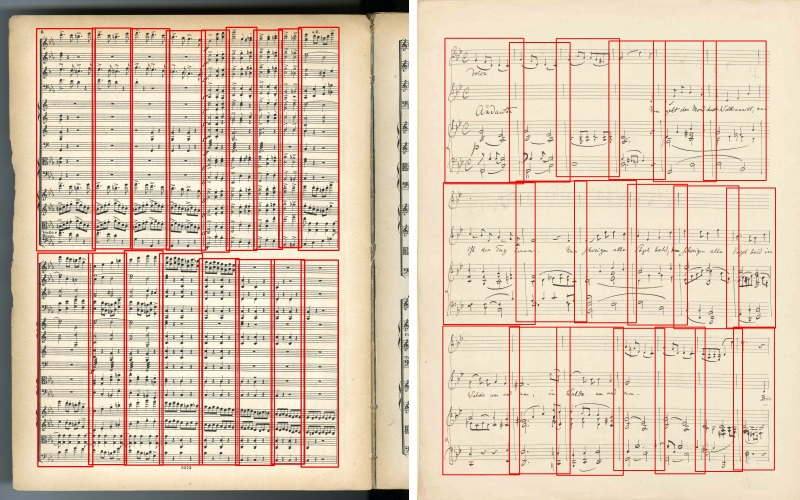
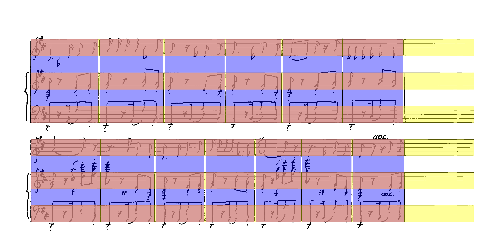
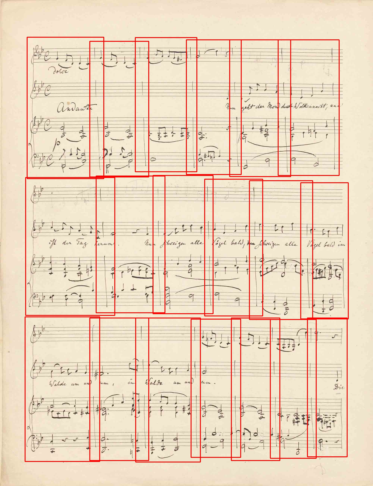

# Measure Detector

This is the repository for the fast and reliable Measure detector with Deep Learning, based on the Tensorflow Object Detection API: 
 
 

# Preparing the application
This repository contains several scripts that can be used independently of each other. 
Before running them, make sure that you have the necessary requirements installed.

If you just want to test this project, head over to the [Demo](demo/) folder for more information. 

## Install required libraries

- Python 3.6 or 3.7
- Tensorflow 1.13.1 (or optionally tensorflow-gpu 1.13.1)
- pycocotools (more [infos](https://github.com/matterport/Mask_RCNN/issues/6#issuecomment-341503509))
    - On Linux, run `pip install git+https://github.com/waleedka/cocoapi.git#egg=pycocotools&subdirectory=PythonAPI`
    - On Windows, run `pip install git+https://github.com/philferriere/cocoapi.git#egg=pycocotools^&subdirectory=PythonAPI`
- Some libraries, as specified in [requirements.txt](requirements.txt)

## Adding source to Python path
There are two ways of making sure, that the python script discovers the correct sources and binaries:

### Permanently linking the source code as pip package (recommended)
To permanently link the source-code of the project, for Python to be able to find it, you can link the two packages by running:
```bash
# From MeasureDetector/
pip install -e .
# From MeasureDetector/research/
pip install -e .
cd slim
# From inside MeasureDetector/research/slim
pip install -e .
```

### Temporarily adding the source code before running a script
Make sure you have all required folders appended to the [Python path](https://github.com/tensorflow/models/blob/master/research/object_detection/g3doc/installation.md#add-libraries-to-pythonpath). This can temporarily be done inside a shell, before calling any training scrips by the following commands:

For Linux:
```bash
# From MeasureDetector/
export PYTHONPATH=$PYTHONPATH:`pwd`/MeasureDetector:`pwd`/research:`pwd`/research/slim
```

For Windows (Powershell):
```powershell
$pathToGitRoot = "[GIT_ROOT]"
$pathToSourceRoot = "$($pathToGitRoot)/object_detection"
$env:PYTHONPATH = "$($pathToGitRoot);$($pathToSourceRoot);$($pathToGitRoot)/slim"
```

## Build Protobuf 
Tensorflow Object Detection API requires to build a few python files from underlying protobuf-specifications. To do so, we run the Protobuf-Compiler 

### Linux

```bash
# Install Protobuf-Compiler, e.g.,
sudo apt install protobuf-compiler
# From MeasureDetector/research/
protoc object_detection/protos/*.proto --python_out=.
```

### Windows

> Run [`DownloadAndBuildProtocolBuffers.ps1`](MusicObjectDetector/DownloadAndBuildProtocolBuffers.ps1) to automate this step or manually build the protobufs by first installing [protocol buffers](https://developers.google.com/protocol-buffers/docs/downloads) and then run:

```bash
# From MeasureDetector/research/
protoc object_detection/protos/*.proto --python_out=.
```

Note, that under Windows, you have to use [version 3.4.0](https://github.com/google/protobuf/releases/download/v3.4.0/) because of an [open bug in later versions.](https://github.com/google/protobuf/issues/3957)

# Datasets
A number of datasets can be used for training the Measure Detector. The MUSCIMA++ dataset is freely available and can be used to verify your installation works, before running the training on a larger dataset.


## MUSCIMA++
The MUSCIMA++ dataset contains 140 images of handwritten music scores with manually annotated measure and staff line information. Therefore it includes three different types of information: 

- Staff lines (yellow)
- Staff measures (a measure on a single staff, red)
- System measures (a measure that spans across the entire system, blue)



> Such images can be produced with the [`MeasureVisualizer.py`](https://omr-datasets.readthedocs.io/en/latest/image_generators/MeasureVisualizer.html) script that takes an image, a json-file with the annotations and creates the annotated figure.

To obtain the MUSCIMA++ dataset, simply run
```bash
# From MeasureDetector/MeasureDetector/
python prepare_muscima-pp_dataset.py
```

Afterwards you have to convert the dataset to into the TF-Record format for Tensorflow to be able to read the data quickly. By default, only the system_measure annotations will be used (see [source, lines 54-56](MeasureDetector/create_tf_record_from_individual_json_files.py)). 
    
```bash
# From MeasureDetector/MeasureDetector/
python create_tf_record_from_individual_json_files.py --image_directory data/muscima_pp/v1.0/data/images --annotation_directory data/muscima_pp/v1.0/data/json --output_path_training_split=data/muscima_pp/muscima_pp_training.record --output_path_validation_split=data/muscima_pp/muscima_pp_validation.record --output_path_test_split=data/muscima_pp/muscima_pp_test.record --num_shards 1 
```

If you just want to train on MUSCIMA++, proceed to [training section.](#train-the-detector)

## Edirom
For working with an [Edirom](https://www.edirom.de/) dataset, such as [Freischütz](https://freischuetz-digital.de/edition.html), you have to download that dataset first with the `prepare_edirom_dataset.py`. To avoid repeated crawling of that service, the URLs have to be provided manually. Please contact us if you are interested in this dataset.
 
 
 
## Custom Dataset
If you want to use your own dataset, all you need to do is to provide two things. An image (e.g., `image-1.png`) and a JSON-file with the same name (e.g., `image-1.json`), containing the bounding-box annotations in the following simple format:

```json
{
  "width": 3487,
  "height": 1710,
  "engraving": "handwritten",
  "system_measures": [
    {
      "left": 215,
      "top": 1205,
      "right": 865,
      "bottom": 1560
    },
    ...
  ],
  "stave_measures": [
    {
      "left": 216,
      "top": 265,
      "right": 678,
      "bottom": 384
    },
    ...
  ],
  "staves": [
    {
      "left": 216,
      "top": 265,
      "right": 3347,
      "bottom": 384
    }, 
    ...
  ]
}
```

Note that if you only want to train for system measures, you can just leave the lists for `stave_measures` and `staves` empty. The `engraving` field is also optional, but should be provided, if you want to create a balanced dataset (see below).

### Converting existing annotations
If you have existing annotations, but in a different format, you can either parse them directly into a TF-Record on your own (see [Create TF-Record Script](MeasureDetector/create_tf_record_from_individual_json_files.py)) or first convert them into the format, specified above and then use the existing scripts. An example conversion is given in [`prepare_custom_dataset.py`](MeasureDetector/prepare_custom_dataset.py), which converts the following `dataset.json` file into the format of one JSON-file per image.

```json
{
  "metadata": {
    "name": "Dataset-X",
    "date": "2019-03-19",    
  },
  "root_dir": "dataset_root",
  "concordances": [...]
  "sources": {
    "source-1": {
      "root_dir": "source-1",
      "type": "handwritten",
      "pages": [
        {
          "image": "C_10_A_RF-SPsc_001v.jpg",
          "width": 1600,
          "height": 1200,
          "annotations": {
            "measures": [
              {
                "bbox": {
                  "x": 150,
                  "y": 60,
                  "width": 357,
                  "height": 1051
                }
              },
              ...
            ]
          }
        },
		...
	  ]
	},
	...
  }
}
```

## Joining datasets
If you have a number of datasets, you might want to join them to train the measure detector on all of them. Put all of them into one directory, e.g., `MeasureDetectionDatasets` and then run 

```bash
# From MeasureDetector/MeasureDetector
python create_joint_dataset_annotations.py --dataset_directory MeasureDetectionDatasets
```

This will create four files: A json file with all annotations and three distinct files which contain random splits for training, validation and test.

Finally you can take any of these json-files to create the TF-Record file that will be used for training. 
 
```bash
# From MeasureDetector/MeasureDetector
python create_tf_record_from_joint_dataset.py --dataset_directory MeasureDetectionDatasets --annotation_filename training_joint_dataset.json --output_path MeasureDetectionDatasets\training.record --target_size=4000 --allow_sample_reuse
python create_tf_record_from_joint_dataset.py --dataset_directory MeasureDetectionDatasets --annotation_filename validation_joint_dataset.json --output_path MeasureDetectionDatasets\validation.record --target_size=800
python create_tf_record_from_joint_dataset.py --dataset_directory MeasureDetectionDatasets --annotation_filename test_joint_dataset.json --output_path MeasureDetectionDatasets\test.record --target_size=800
```
 
Those scripts will automatically sub-sample the dataset to be equally drawn from the categories `[Handwritten, Typeset]` x `[No staves, One stave, Two staves, Three staves, More staves]` until the target size is reached. That means, individual samples can be represented multiple times in the record.

Keep in mind, that you have to specify the target size, which has to be smaller or equal to the actual samples of the split. If `--allow_sample_reuse` is specified, it will try to balance the dataset, by re-using samples from categories with fewer samples. 
 
# Running the training

Before starting the training, you need to change the paths, according to your system

- in the configuration, you want to run, e.g. `configurations/faster_rcnn_inception_resnet_v2_atrous_muscima_pretrained_reduced_classes.config`


To start the training: 
```bash
# From MeasureDetector/
python research/object_detection/legacy/train.py --pipeline_config_path="MeasureDetector/configurations/faster_rcnn_inception_v2_all_datasets.config" --train_dir="data/faster_rcnn_inception_v2_all_datasets"
```

To start the validation: 

```bash
# From MeasureDetector/
python research/object_detection/eval.py --logtostderr --pipeline_config_path="MeasureDetector/configurations/faster_rcnn_inception_v2_all_datasets.config" --checkpoint_dir="data/faster_rcnn_inception_v2_all_datasets" --eval_dir="data/faster_rcnn_inception_v2_all_datasets/eval"
```

A few remarks: The two scripts can and should be run at the same time, to get a live evaluation during the training. The values, may be visualized by calling `tensorboard --logdir=checkpoint-directory`.

## Restricting GPU memory usage

Notice that usually Tensorflow allocates the entire memory of your graphics card for the training. In order to run both training and validation at the same time, you might have to restrict Tensorflow from doing so, by opening [`train.py`](research/object_detection/legacy/train.py) and [`eval.py`](research/object_detection/legacy/eval.py) and uncomment the respective (prepared) lines in the main function. E.g.:

```
gpu_options = tf.GPUOptions(per_process_gpu_memory_fraction=0.3)
sess = tf.Session(config=tf.ConfigProto(gpu_options=gpu_options))
```

## Training with pre-trained weights

It is recommended that you use pre-trained weights for known networks to speed up training and improve overall results. To do so, head over to the [Tensorflow detection model zoo](https://github.com/tensorflow/models/blob/master/research/object_detection/g3doc/detection_model_zoo.md), download and unzip the respective trained model, e.g. `faster_rcnn_inception_resnet_v2_atrous_coco` for reproducing the best results, we obtained. The path to the unzipped files, must be specified inside of the configuration in the `train_config`-section, e.g.

```
train-config: {
  fine_tune_checkpoint: "C:/Users/Alex/Repositories/MusicObjectDetector-TF/MusicObjectDetector/data/faster_rcnn_inception_resnet_v2_atrous_coco_2017_11_08/model.ckpt"
  from_detection_checkpoint: true
}
```

> Note that inside that folder, there is no actual file, called `model.ckpt`, but multiple files called `model.ckpt.[something]`.


# Inference

Once, you have a trained model that you are happy with, you can freeze it for deployment and usage for inference.

```bash
# From MeasureDetector
python research/object_detection/export_inference_graph.py --input_type image_tensor --pipeline_config_path "data\faster_rcnn_inception_resnet_v2_atrous_edirom\pipeline.config" --trained_checkpoint_prefix "data\faster_rcnn_inception_resnet_v2_atrous_edirom\model.ckpt-18428" --output_directory output_inference_graph
```

To run inference, see the [Demo](demo/) folder for more information. 


# License

Published under MIT License,

Copyright (c) 2019 [Alexander Pacha](http://alexanderpacha.com), [TU Wien](https://www.ims.tuwien.ac.at/people/alexander-pacha)

Permission is hereby granted, free of charge, to any person obtaining a copy
of this software and associated documentation files (the "Software"), to deal
in the Software without restriction, including without limitation the rights
to use, copy, modify, merge, publish, distribute, sublicense, and/or sell
copies of the Software, and to permit persons to whom the Software is
furnished to do so, subject to the following conditions:

The above copyright notice and this permission notice shall be included in all
copies or substantial portions of the Software.

THE SOFTWARE IS PROVIDED "AS IS", WITHOUT WARRANTY OF ANY KIND, EXPRESS OR
IMPLIED, INCLUDING BUT NOT LIMITED TO THE WARRANTIES OF MERCHANTABILITY,
FITNESS FOR A PARTICULAR PURPOSE AND NONINFRINGEMENT. IN NO EVENT SHALL THE
AUTHORS OR COPYRIGHT HOLDERS BE LIABLE FOR ANY CLAIM, DAMAGES OR OTHER
LIABILITY, WHETHER IN AN ACTION OF CONTRACT, TORT OR OTHERWISE, ARISING FROM,
OUT OF OR IN CONNECTION WITH THE SOFTWARE OR THE USE OR OTHER DEALINGS IN THE
SOFTWARE.
